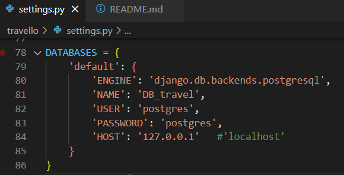
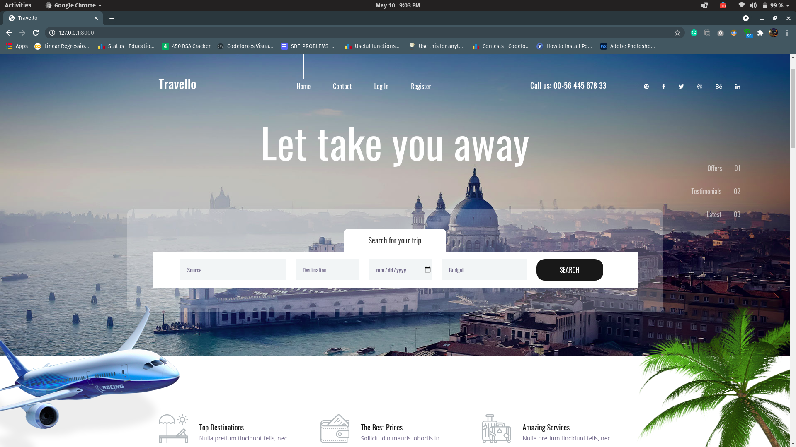
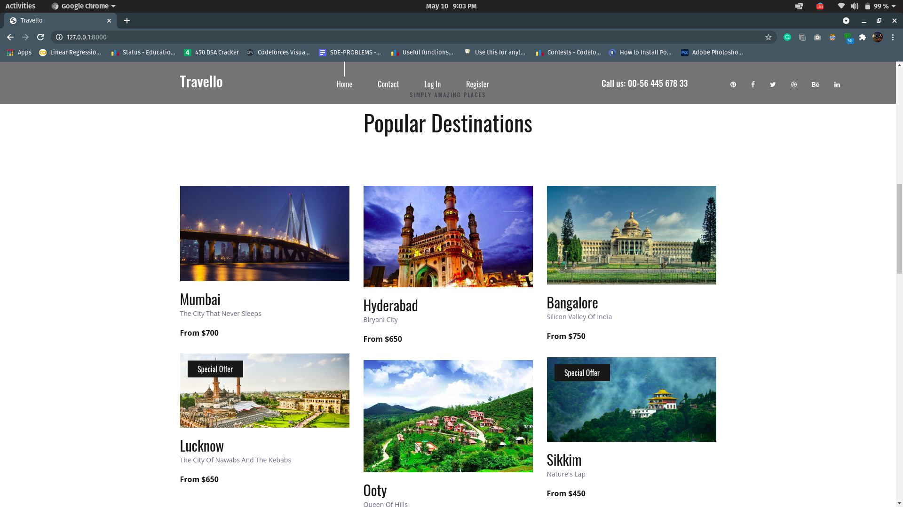
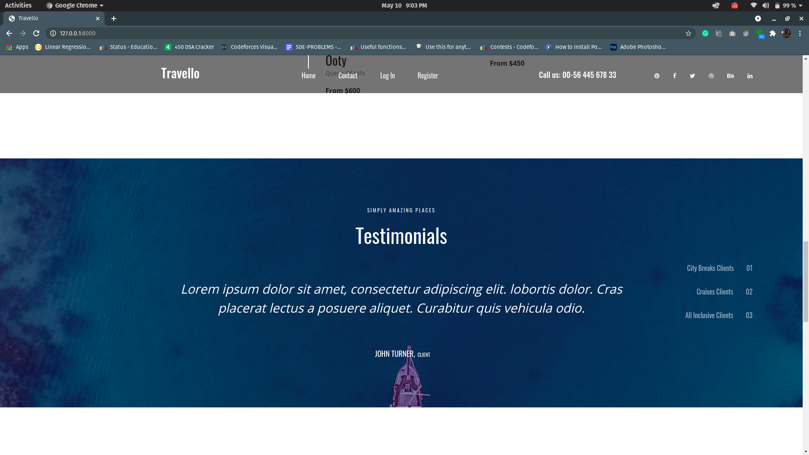
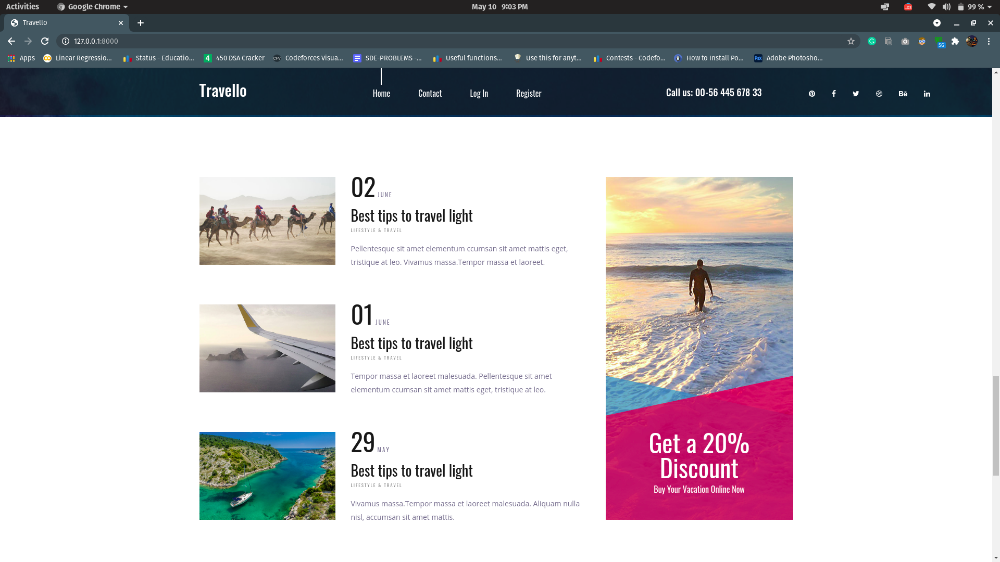
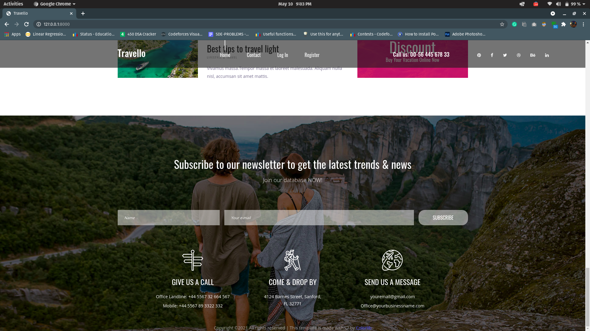
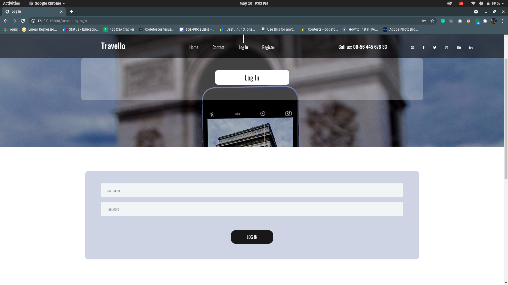
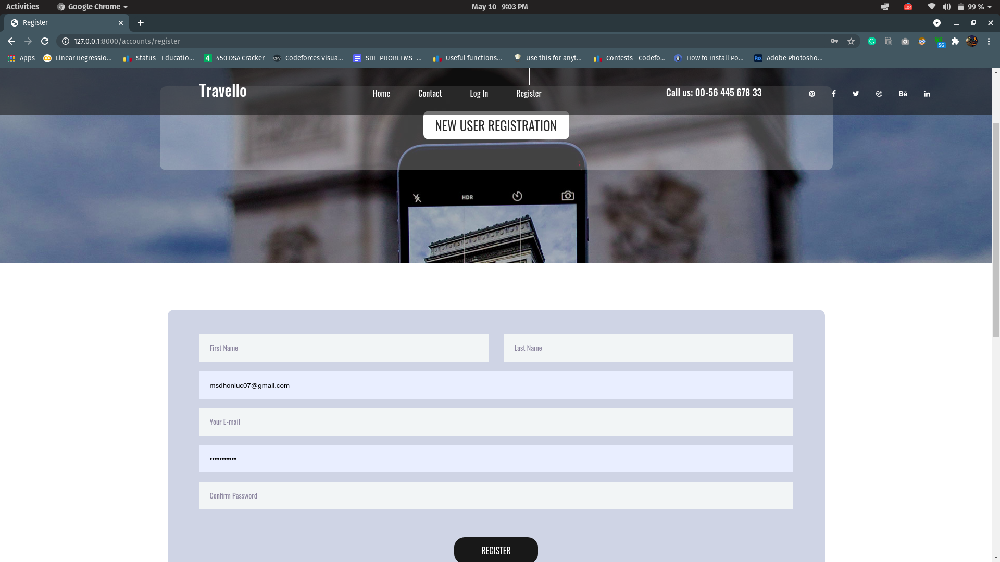
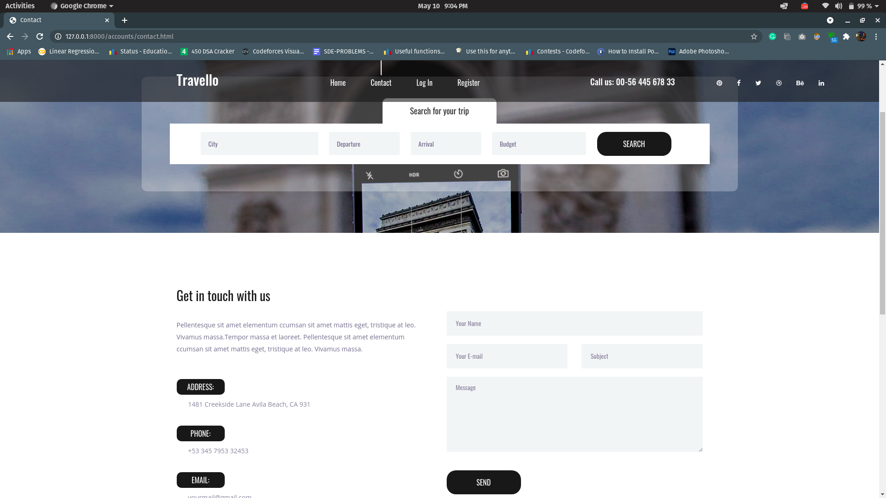

# 🌐 TRAVELLO

A travel planner website UI integrated with PostgreSQL. User can register and sign in.

---

## Setup

### DB
(source code的tables)
1. download [PostgreSQL 14](https://www.postgresql.org/download/) and [pgAdmin](https://www.pgadmin.org/) (GUI介面)
2. Open pgAdmin4，在PostgreSQL/Database按右鍵 -> Create Database -> 命名為`DB_travel`
    
        
    
    - 首次下載pgAdmin 如果系統要求設定user password，則設為`postgres`
           
    
3. Open travello/settings.py, use the correct 'PASSWORD' in DATABASES. 
4. 第一次runserver 後，應該就能在pgAdmin看到DB_travel/Schemas/public/Tables 內看到多個tables。在一table按右鍵 -> View/Edit data -> All rows ，即可看到表格形式的table。
<!-- python manage.py loaddata whole.json  -->

### Backend
All are done in the root directory

1. set virtual environment

    ```sh
    # for windows
    pip install virtualenv
    py -3 -m venv .venv
    .venv\scripts\activate
    ```
    ```sh
    # for mac(不確定是不是這樣)
    pip install virtualenv
    virtualenv venv
    source venv/bin/activate
    ```

2. install packages

    ```sh
    pip install -r requirements.txt
    # OR
    python -m pip install -r requirements.txt
    ```

3. start server

    ```sh
    python manage.py makemigrations
    python manage.py migrate
    python manage.py runserver
    # https://127.0.0.1:8000 in your browser
    ```

### Create SUPER USER

```sh
python manage.py createsuperuser

```

- Set username & password as you like
- Go to http://127.0.0.1:8000/admin/ Add some testing data and check in pgAdmin to see if the tables have updated some new rows.

---

## :bulb: Built Using

<!-- - [**BOOTSTRAP**](https://getbootstrap.com/)   -->
- [**DJANGO**](https://www.djangoproject.com/)
- [**POSTGRESQL**](https://www.postgresql.org/)

- [**kanban**](https://www.notion.so/65fda7ca561d472d85257791d9525a06?v=16f41c887d7249e4af52043d52b61dd7)
<!-- 
---

## :iphone: Screenshots










---

## :man: Project Created & Maintained By

 <br>Utkarsh Chaurasia
<p>
<a href = "https://github.com/UtkarshChaurasia"></a>
<a href = "https://www.linkedin.com/in/utkarshchaurasia/">

</a>
</p>
   -->
   
---

## Reference
https://github.com/UtkarshChaurasia/travello.git
